# Stock Receiving Process Map

**Store:** Pandora Retail Store
**Process:** Standard Replenishment Stock Receiving
**Source:** Store colleague conversation transcript (14 November 2025)
**Participants:** Sarah (Store Manager), Marcus (Deputy Manager), Priya (Sales Associate)

---

## Process Flow Diagram

```mermaid
flowchart TD
    subgraph RECEIPT["📦 RECEIPT PHASE"]
        A[Courier Arrives] --> B{Staff Available<br/>at Back Entrance?}
        B -->|Yes| C[Verify Courier ID]
        B -->|No| W1[Wait for Staff<br/>5-10 min delay]
        W1 --> C
        C --> D{Visual Inspection:<br/>Packaging Damaged?}
        D -->|No| E[Count Boxes vs<br/>Courier Record]
        D -->|Yes| F[Photograph Damage<br/>Note on Device<br/>Call Warehouse]
        F --> G{Accept or<br/>Reject Parcel?}
        G -->|Accept with Note| E
        G -->|Reject| END1[Return to Courier]
        E --> H[Sign Electronic Device]
        H --> I[Courier Departs]
    end

    subgraph STORAGE["🔒 SECURE STORAGE PHASE"]
        I --> J[Transport to Stockroom]
        J --> K{Stockroom<br/>Space Available?}
        K -->|Yes| L[Place in Secure<br/>Storage/Cage]
        K -->|No| W2[Reorganise Storage<br/>10-15 min delay]
        W2 --> L
        L --> M[Lock Stockroom]
    end

    subgraph QUEUE["⏳ QUEUE PHASE"]
        M --> N{Staff Available<br/>to Process?}
        N -->|Yes| O[Move to Processing Area]
        N -->|No| W3[Wait in Storage<br/>30 min - 7 hours]
        W3 --> N
    end

    subgraph UNPACK["📂 UNPACKING PHASE"]
        O --> P[Open Outer Packaging<br/>with Safety Cutters]
        P --> Q{Delivery Note<br/>Present?}
        Q -->|Yes| R[Remove Items &<br/>Void Fill Material]
        Q -->|No| W4[Call Warehouse<br/>Cross-reference System<br/>45-60 min delay]
        W4 --> R
        R --> S{Multiple Order<br/>Types?}
        S -->|Yes| T[Sort by Order Type:<br/>Replenishment/Special Order/Transfer]
        S -->|No| U[Lay Out Items<br/>for Verification]
        T --> U
    end

    subgraph VERIFY["✅ VERIFICATION PHASE"]
        U --> V[Pick Up Item Box]
        V --> W[Read SKU Code]
        W --> X{SKU on<br/>Delivery Note?}
        X -->|Yes| Y{Quantity<br/>Matches?}
        X -->|No| ERR1[Wrong Item Process:<br/>15-20 min]
        Y -->|Yes| Z[Tick Off Item<br/>Place in Verified Pile]
        Y -->|No| ERR2[Quantity Discrepancy:<br/>Document & Report<br/>10 min]
        ERR1 --> Z
        ERR2 --> Z
        Z --> AA{More Items<br/>to Check?}
        AA -->|Yes| V
        AA -->|No| BB{All Items<br/>Accounted For?}
        BB -->|Yes| CC[Verification Complete]
        BB -->|No| ERR3[Missing Item Process:<br/>Incident Report<br/>60+ min]
        ERR3 --> CC
    end

    subgraph DAMAGE["🔍 DAMAGE ASSESSMENT"]
        CC --> DD{Any Damaged<br/>Inner Packaging?}
        DD -->|No| EE[Proceed to System Loading]
        DD -->|Yes| FF[Open & Inspect Product]
        FF --> GG{Product<br/>Damaged?}
        GG -->|No - Case Only| EE
        GG -->|Yes| HH[Photograph &<br/>Complete Damage Report]
        HH --> II{Disposition?}
        II -->|Sellable| EE
        II -->|Display Only| JJ[Mark as Display]
        II -->|Return| KK[Package for Return<br/>20-30 min per item]
        JJ --> EE
        KK --> EE
    end

    subgraph SYSTEM["💻 SYSTEM LOADING PHASE"]
        EE --> LL[Scan Item Barcode]
        LL --> MM{Barcode<br/>Readable?}
        MM -->|Yes| NN{System<br/>Connected?}
        MM -->|No| OO[Manual Entry<br/>12-digit Code]
        OO --> NN
        NN -->|Yes| PP{Item in<br/>System?}
        NN -->|No| W5[Wait for WiFi<br/>Reconnect & Verify]
        W5 --> NN
        PP -->|Yes| QQ[Confirm Receipt]
        PP -->|No| W6[Contact Head Office<br/>Wait 1-3 days]
        W6 --> PP
        QQ --> RR{More Items<br/>to Scan?}
        RR -->|Yes| LL
        RR -->|No| SS[System Loading Complete]
    end

    subgraph PLACEMENT["🏪 PLACEMENT PHASE"]
        SS --> TT{Item Location<br/>Known?}
        TT -->|Yes| UU[Walk to Display Location]
        TT -->|No| VV[Check Planogram<br/>Find Space<br/>5 min per item]
        VV --> UU
        UU --> WW[Place Item Correctly]
        WW --> XX{Destination?}
        XX -->|Shop Floor| YY[Display Placement]
        XX -->|Till Drawer| ZZ[Behind Counter Storage]
        XX -->|Backstock| AAA[Organised Storage]
        YY --> BBB{More Items?}
        ZZ --> BBB
        AAA --> BBB
        BBB -->|Yes| TT
        BBB -->|No| CCC[Placement Complete]
    end

    subgraph ADMIN["📋 ADMINISTRATION PHASE"]
        CCC --> DDD[File Delivery Note]
        DDD --> EEE[File Discrepancy Reports]
        EEE --> FFF[File Damage Reports]
        FFF --> GGG[Final Reconciliation Check]
        GGG --> HHH{Totals Match?}
        HHH -->|Yes| III[✅ PROCESS COMPLETE]
        HHH -->|No| JJJ[Investigate Discrepancy]
        JJJ --> GGG
    end

    style A fill:#e1f5fe
    style III fill:#c8e6c9
    style END1 fill:#ffcdd2
    style W1 fill:#fff3e0
    style W2 fill:#fff3e0
    style W3 fill:#fff3e0
    style W4 fill:#fff3e0
    style W5 fill:#fff3e0
    style W6 fill:#fff3e0
    style ERR1 fill:#ffcdd2
    style ERR2 fill:#ffcdd2
    style ERR3 fill:#ffcdd2
```



---

## Process Steps Summary

| Phase | Step | Description | Normal Time | Problem Time |
|-------|------|-------------|-------------|--------------|
| **Receipt** | 1.1 | Courier arrives at back entrance | - | - |
| | 1.2 | Staff availability check | 0 min | 5-10 min |
| | 1.3 | Verify courier ID | 1 min | - |
| | 1.4 | Visual inspection of outer packaging | 2 min | 25 min |
| | 1.5 | Count boxes against delivery record | 1 min | - |
| | 1.6 | Sign electronic device | 1 min | - |
| | **Subtotal** | | **5 min** | **30 min** |
| **Storage** | 2.1 | Transport parcel to stockroom | 0.5 min | - |
| | 2.2 | Place in secure storage/cage | 2 min | 15 min |
| | 2.3 | Lock stockroom | 0.5 min | - |
| | **Subtotal** | | **3 min** | **15 min** |
| **Queue** | 3.1 | Wait for processing availability | 30 min | 7 hours |
| **Unpacking** | 4.1 | Move parcel to processing desk | 1 min | - |
| | 4.2 | Open outer packaging (safety cutters) | 2 min | - |
| | 4.3 | Locate delivery note | 1 min | 60 min |
| | 4.4 | Remove items and void fill | 10-15 min | - |
| | 4.5 | Sort by order type (if multiple) | 0-10 min | - |
| | **Subtotal** | | **15 min** | **75 min** |
| **Verification** | 5.1 | Item-by-item SKU check (×50 items) | 25-30 min | - |
| | 5.2 | Handle quantity discrepancies | 0 min | 10 min each |
| | 5.3 | Handle wrong items | 0 min | 15-20 min each |
| | 5.4 | Handle missing items | 0 min | 60+ min each |
| | **Subtotal** | | **30 min** | **120+ min** |
| **Damage** | 6.1 | Assess inner packaging damage | 0-5 min | 3-5 min/item |
| | 6.2 | Process damaged items for return | 0 min | 20-30 min/item |
| **System** | 7.1 | Scan barcodes (×50 items) | 15-20 min | - |
| | 7.2 | Handle unreadable barcodes | 0 min | +2 min/item |
| | 7.3 | Handle connectivity issues | 0 min | Variable |
| | 7.4 | Handle items not in system | 0 min | 1-3 days |
| | **Subtotal** | | **20 min** | **Days** |
| **Placement** | 8.1 | Place items on shop floor (×50) | 40 min | - |
| | 8.2 | New item location lookup | 0 min | 5 min/item |
| | **Subtotal** | | **40 min** | **80+ min** |
| **Admin** | 9.1 | File all paperwork | 5 min | - |
| | 9.2 | Final reconciliation check | 10 min | - |
| | **Subtotal** | | **15 min** | **15 min** |

### Total Process Time (50-piece standard delivery)

| Scenario | Time |
|----------|------|
| **Best Case** (no issues) | ~2 hours |
| **Typical Case** (minor issues) | ~3 hours |
| **Worst Case** (major issues) | 6+ hours |
| **Critical Exception** (items not in system) | Days of partial completion |

---

## Pain Points Analysis

### 🔴 CRITICAL PAIN POINTS

| # | Pain Point | Impact | Frequency | Time Impact | Root Cause |
|---|------------|--------|-----------|-------------|------------|
| 1 | **Missing high-value items** | Loss investigation, CCTV review, incident reports, management escalation | Monthly | 2+ hours per incident | Warehouse picking errors, transit theft |
| 2 | **Items not in system** | Cannot sell, cannot display, customer disappointment | Every new collection | 1-3 days delay | Head office data loading lag |
| 3 | **WiFi connectivity in stockroom** | Uncertainty if scans saved, double-checking required | Weekly | Doubles scanning time | Infrastructure underinvestment |

### 🟠 HIGH IMPACT PAIN POINTS

| # | Pain Point | Impact | Frequency | Time Impact | Root Cause |
|---|------------|--------|-----------|-------------|------------|
| 4 | **Missing delivery notes** | Cannot verify, warehouse calls required, system cross-referencing | Occasional | 45-60 min per occurrence | Warehouse packing process |
| 5 | **Unpredictable courier timing** | Staff unavailable, customer service interrupted | Daily | 5-10 min wait average | Courier scheduling |
| 6 | **Peak season storage constraints** | Time finding space, reorganisation required | Seasonal | 10-15 min per delivery | Limited stockroom capacity |
| 7 | **Damaged packaging assessment** | Open, inspect, document, decide disposition | Weekly | 20-30 min per damaged item | Transit handling, packing quality |

### 🟡 MODERATE IMPACT PAIN POINTS

| # | Pain Point | Impact | Frequency | Time Impact | Root Cause |
|---|------------|--------|-----------|-------------|------------|
| 8 | **Quantity discrepancies** | Documentation, reporting, reconciliation | Weekly | 10 min per discrepancy | Warehouse picking accuracy |
| 9 | **Wrong items shipped** | Determine correct destination, arrange forwarding | Monthly | 15-20 min per item | Warehouse picking errors |
| 10 | **Disorganised warehouse packing** | Extra sorting time before verification | Frequent | 10-15 min extra | No packing standards |
| 11 | **Multiple order types in one parcel** | Sorting required, different handling procedures | Common | 10 min extra | Consolidation efficiency vs. store convenience |
| 12 | **Unreadable barcodes** | Manual 12-digit entry, error-prone | Occasional | 2 min per item | Label print quality |
| 13 | **New item placement** | Planogram lookup, space finding | Every new product | 5 min per item vs. 2 min | No pre-communication of locations |

### 🔵 PROCESS INEFFICIENCIES

| # | Pain Point | Impact | Frequency | Time Impact | Root Cause |
|---|------------|--------|-----------|-------------|------------|
| 14 | **Processing delayed by trading** | Stock sits unprocessed during peak hours | Daily | 30 min - 7 hours | Staffing levels vs. customer priority |
| 15 | **Manual verification process** | 30-40 seconds per item, entirely manual | Every delivery | 25-30 min for 50 items | No automation |
| 16 | **Paper-based filing** | Physical document handling required | Every delivery | 5-15 min | No digital workflow |

---

## Pain Point Heat Map by Phase

```
PHASE              PAIN LEVEL    KEY ISSUES
─────────────────────────────────────────────────────────────────
Receipt            ████░░░░░░    Unpredictable timing, damage handling
Storage            ███░░░░░░░    Space constraints (seasonal)
Queue              █████░░░░░    Competing priorities, long waits
Unpacking          ████░░░░░░    Missing delivery notes, disorganised packing
Verification       ████████░░    Discrepancies, missing items, manual process
Damage Assessment  ████░░░░░░    Time-consuming per-item handling
System Loading     █████████░    Connectivity, items not in system (CRITICAL)
Placement          ███░░░░░░░    New item location unknown
Administration     ██░░░░░░░░    Paper-based but manageable
```

---

## Key Statistics from Transcript

| Metric | Value |
|--------|-------|
| Standard delivery size | 30-50 pieces |
| Large delivery size | 120+ pieces |
| Courier arrival window | 08:30 - 10:00 (can be 11:15+) |
| Best case processing time | ~2 hours |
| Worst case example | 6 hours (Christmas peak) |
| Missing item investigation time | 2+ hours |
| System unavailability delay | 1-3 days |
| Damaged item return processing | 20-30 min each |

---

## Recommendations Summary

### Quick Wins
1. Improve stockroom WiFi infrastructure
2. Establish minimum packing standards at warehouse (organised by product type)
3. Ensure delivery notes always included in parcels

### Medium-Term Improvements
1. Pre-load new product data before physical shipment
2. Implement barcode scanning quality checks at warehouse
3. Provide store planograms for new items in advance of delivery

### Strategic Changes
1. Evaluate automated/assisted verification technology
2. Consider digital delivery documentation
3. Review courier SLAs for delivery window accuracy
4. Assess staffing model against receiving workload

---

*Process map generated from colleague transcript - 14 November 2025*
*Analysis completed: 28 November 2025*
