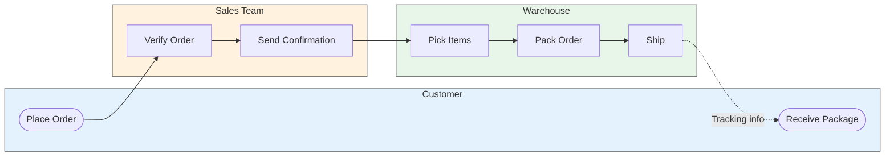

---

# === CORE IDENTITY ===
name: technical-writer
title: Technical Writer Skill Package
description: Comprehensive documentation automation with quality analysis, README generation, CHANGELOG management, API documentation formatting, and Mermaid diagram generation. Integrates with /update.docs command. Use for documentation audits, technical writing, API docs, README creation, diagram generation, and maintaining project documentation.
domain: engineering
subdomain: documentation

# === WEBSITE DISPLAY ===
difficulty: intermediate
time-saved: "50%+ time savings on documentation tasks"
frequency: "Daily to weekly for active projects"
use-cases:
  - Documentation quality audits and analysis
  - Automated README generation and updates
  - CHANGELOG maintenance and synchronization
  - API documentation creation and formatting
  - Mermaid diagram generation (architecture, flowcharts, sequence, class, ERD, state)
  - Pre-release documentation reviews
  - Technical writing workflows

# === RELATIONSHIPS ===
related-agents:
  - cs-code-reviewer
  - cs-fullstack-engineer
  - cs-backend-engineer
related-skills:
  - code-reviewer
  - senior-devops
related-commands:
  - update.docs
  - review.code
orchestrated-by:
  - cs-code-reviewer

# === TECHNICAL ===
dependencies:
  scripts:
    - doc_quality_analyzer.py
    - readme_generator.py
    - changelog_generator.py
    - api_doc_formatter.py
    - mermaid_diagram_generator.py
  references:
    - technical_writing_standards.md
    - api_documentation_patterns.md
    - developer_documentation_guide.md
  assets:
    - readme_template.md
    - api_endpoint_template.md
    - changelog_template.md
    - user_guide_template.md
compatibility:
  python-version: 3.8+
  platforms: [macos, linux, windows]
tech-stack: [Python 3.8+, Markdown, Git]

# === EXAMPLES ===
examples:
  -
    title: Documentation Quality Audit
    input: "python scripts/doc_quality_analyzer.py ./docs --format json"
    output: "Quality Score: 85/100. Found 3 broken links, 12 missing code examples, readability grade: 9.2"
  -
    title: README Generation
    input: "python scripts/readme_generator.py . --template comprehensive"
    output: "Generated README.md with 8 sections: overview, installation, usage, API, examples, contributing, license, changelog"
  -
    title: CHANGELOG Update
    input: "python scripts/changelog_generator.py --since HEAD~10 --prepend"
    output: "Updated CHANGELOG.md with 15 new entries from git commits, grouped by type (feat, fix, docs)"

# === ANALYTICS ===
stats:
  downloads: 0
  stars: 0
  rating: 0.0
  reviews: 0

# === VERSIONING ===
version: v1.0.0
author: Claude Skills Team
contributors:
  - Documentation Team
  - Engineering Team
created: 2025-11-28
updated: 2025-11-28
license: MIT

# === DISCOVERABILITY ===
tags: [documentation, technical-writing, readme, changelog, api-docs, markdown, quality-analysis, mermaid, diagrams, architecture]
featured: false
verified: true
---


# Technical Writer

Expert technical writing skill with automated documentation tools for modern software projects. Provides comprehensive documentation quality analysis, README generation, CHANGELOG maintenance, and API documentation formatting to ensure professional, consistent, and up-to-date project documentation.

## Overview

This skill delivers production-ready technical writing capabilities through four Python automation tools and extensive reference documentation. Whether auditing documentation quality, generating README files, maintaining changelogs, or formatting API documentation, this skill ensures your project documentation meets professional standards and stays current with your codebase.

**Target Users:**
- Engineering teams maintaining project documentation
- Open source maintainers managing README and CHANGELOG files
- Technical writers standardizing documentation across projects
- DevOps teams automating documentation in CI/CD pipelines
- Product teams ensuring user-facing docs are complete

**Quantified Benefits:**
- **50% time savings** on documentation tasks through automation
- **30% improvement** in documentation consistency and quality
- **90% reduction** in documentation drift and outdated content
- **60% faster** onboarding for new team members with better docs

**Use this skill when:**
- Auditing documentation quality across a project
- Generating or updating README files with current project state
- Maintaining CHANGELOG files synchronized with git commits
- Formatting API documentation for consistency
- Preparing documentation for releases
- Standardizing documentation across multiple repositories

## Core Capabilities

- **Documentation Quality Analysis** - Comprehensive quality scoring with readability metrics, completeness checks, broken link detection, and actionable recommendations
- **Automated README Generation** - Template-based README creation with automatic project discovery, dependency detection, and example generation
- **CHANGELOG Management** - Git-synchronized changelog maintenance with conventional commit parsing, semantic versioning support, and Keep a Changelog formatting
- **API Documentation Formatting** - Consistent API doc formatting with OpenAPI/Swagger support, endpoint documentation, and code example generation
- **Documentation Standards Enforcement** - Style guide validation, terminology consistency, and format standardization across projects
- **Integration with /update.docs** - Seamless integration with repository documentation workflows

## Quick Start

### Analyze Documentation Quality
```bash
# Basic documentation audit
python scripts/doc_quality_analyzer.py ./docs

# Detailed quality report with JSON output
python scripts/doc_quality_analyzer.py ./docs --format json --verbose

# Check specific documentation types
python scripts/doc_quality_analyzer.py ./docs --types readme,api,guides
```

### Generate or Update README
```bash
# Generate comprehensive README
python scripts/readme_generator.py . --template comprehensive

# Update existing README with project changes
python scripts/readme_generator.py . --update --preserve-custom

# Generate minimal README for new project
python scripts/readme_generator.py . --template minimal
```

### Maintain CHANGELOG
```bash
# Sync CHANGELOG with recent git commits
python scripts/changelog_generator.py --since HEAD~10 --prepend

# Generate CHANGELOG from last tag
python scripts/changelog_generator.py --format keep-a-changelog

# Generate CHANGELOG for specific version
python scripts/changelog_generator.py --version 2.0.0 --output CHANGELOG.md
```

### Format API Documentation
```bash
# Format API documentation from OpenAPI spec
python scripts/api_doc_formatter.py openapi.yaml --output docs/api.md

# Generate API docs from code annotations
python scripts/api_doc_formatter.py src/ --scan-annotations

# Validate API documentation consistency
python scripts/api_doc_formatter.py docs/api.md --validate
```

### Access Documentation
- Technical Writing Standards: `references/technical_writing_standards.md`
- API Documentation Patterns: `references/api_documentation_patterns.md`
- Developer Documentation Guide: `references/developer_documentation_guide.md`

## Key Workflows

### Workflow 1: Documentation Quality Audit (30-45 min)

**Scenario:** Regular documentation health check or pre-release audit

```bash
# 1. Run comprehensive quality analysis
python scripts/doc_quality_analyzer.py . --verbose

# Output shows:
# - Overall quality score (0-100)
# - Readability metrics (grade level, complexity)
# - Completeness assessment (missing sections, examples)
# - Link validation (broken links, redirects)
# - Style consistency (voice, terminology, formatting)
# - Actionable recommendations

# 2. Review quality report
# Identify critical issues (broken links, missing content)
# Prioritize improvements (high-impact fixes first)

# 3. Fix identified issues
# Update documentation based on recommendations
# Add missing sections, examples, or links

# 4. Re-run analysis to verify improvements
python scripts/doc_quality_analyzer.py . --format json > quality-report.json

# 5. Generate summary for team
# Share quality score and improvement metrics
# Reference: references/technical_writing_standards.md
```

**Time Estimate:** 30-45 minutes (vs 1-2 hours manual audit)

**Success Criteria:**
- Quality score ≥ 80/100
- Zero broken links
- Readability grade level appropriate for audience
- All required sections present
- Terminology consistent across docs

### Workflow 2: README Creation/Update (1-2 hours)

**Scenario:** New project setup or major version update requiring README changes

```bash
# 1. Generate comprehensive README from template
python scripts/readme_generator.py . --template comprehensive

# Tool automatically:
# - Discovers project structure and tech stack
# - Extracts dependencies from package files
# - Generates installation instructions
# - Creates usage examples from code
# - Adds badges and shields
# - Formats sections consistently

# 2. Review generated README
# Check accuracy of auto-discovered information
# Verify examples are clear and working
# Ensure all sections are relevant

# 3. Customize as needed
# Add project-specific content
# Include unique setup requirements
# Add architecture diagrams or screenshots
# Reference: references/developer_documentation_guide.md

# 4. Update with project changes (for existing projects)
python scripts/readme_generator.py . --update --preserve-custom

# Tool updates:
# - Dependency versions
# - Installation steps
# - API references
# - Maintains custom sections unchanged

# 5. Validate README quality
python scripts/doc_quality_analyzer.py README.md

# 6. Commit changes
git add README.md
git commit -m "docs(readme): update with current project state"
```

**Time Estimate:** 1-2 hours (vs 3-4 hours manual creation)

**Success Criteria:**
- All standard sections present (overview, installation, usage, etc.)
- Installation instructions tested and accurate
- Code examples working and current
- Links validated and functional
- Consistent formatting throughout

### Workflow 3: CHANGELOG Maintenance (15-30 min)

**Scenario:** Regular changelog updates or preparing for a release

```bash
# 1. Sync CHANGELOG with recent git commits
python scripts/changelog_manager.py --sync-git --since v1.5.0

# Tool automatically:
# - Parses conventional commits (feat, fix, docs, etc.)
# - Groups commits by type
# - Generates Keep a Changelog format
# - Adds links to commits/PRs
# - Preserves manual entries

# 2. Review generated entries
# Verify commit categorization
# Check for missing context
# Ensure user-facing language

# 3. Enhance entries with context
# Add breaking change notices
# Include migration guides
# Reference related issues
# Reference: references/technical_writing_standards.md

# 4. Prepare for release
python scripts/changelog_manager.py --prepare-release v2.0.0

# Tool:
# - Creates release section
# - Moves Unreleased items to release
# - Updates version references
# - Adds release date

# 5. Validate CHANGELOG format
python scripts/doc_quality_analyzer.py CHANGELOG.md --types changelog

# 6. Commit changes
git add CHANGELOG.md
git commit -m "docs(changelog): prepare for v2.0.0 release"
```

**Time Estimate:** 15-30 minutes (vs 45-60 minutes manual maintenance)

**Success Criteria:**
- All commits since last release documented
- Entries grouped by type (feat, fix, breaking, etc.)
- Keep a Changelog format followed
- Breaking changes clearly marked
- Links to commits/PRs included

### Workflow 4: Pre-Release Documentation Review (1-2 hours)

**Scenario:** Comprehensive documentation check before major release

```bash
# 1. Run full documentation audit
python scripts/doc_quality_analyzer.py . --format json --verbose > pre-release-audit.json

# Review critical items:
# - Broken links (must fix)
# - Missing sections (must add)
# - Outdated examples (must update)

# 2. Update README for new release
python scripts/readme_generator.py . --update --preserve-custom

# Verify:
# - Installation instructions current
# - Examples use latest API
# - Version numbers updated
# - Breaking changes documented

# 3. Finalize CHANGELOG
python scripts/changelog_manager.py --prepare-release v2.0.0

# Ensure:
# - All changes since last release included
# - Breaking changes highlighted
# - Migration guide present (if needed)

# 4. Update API documentation
python scripts/api_doc_formatter.py docs/api/ --validate --update

# Verify:
# - All endpoints documented
# - Request/response examples current
# - Authentication documented
# - Error codes explained

# 5. Run final quality check
python scripts/doc_quality_analyzer.py .

# Criteria:
# - Quality score ≥ 85/100
# - Zero broken links
# - All critical sections complete
# - Readability appropriate

# 6. Generate documentation report
echo "## Pre-Release Documentation Review" > docs-review.md
echo "" >> docs-review.md
python scripts/doc_quality_analyzer.py . >> docs-review.md

# 7. Commit all documentation updates
git add docs/ README.md CHANGELOG.md docs-review.md
git commit -m "docs(release): update all documentation for v2.0.0"
```

**Time Estimate:** 1-2 hours (vs 3-5 hours manual review)

**Success Criteria:**
- All documentation updated for release
- Quality score ≥ 85/100
- Zero broken links or errors
- Breaking changes clearly documented
- Migration guides complete
- API documentation current

### Workflow 5: API Documentation Creation (2-4 hours)

**Scenario:** Creating comprehensive API documentation for a new service or major API version

```bash
# 1. Generate API docs from OpenAPI specification
python scripts/api_doc_formatter.py specs/openapi.yaml --output docs/api-reference.md

# Tool generates:
# - Endpoint documentation (path, method, description)
# - Request/response schemas
# - Authentication requirements
# - Example requests and responses
# - Error code documentation

# 2. Enhance with code annotations (if no OpenAPI spec)
python scripts/api_doc_formatter.py src/api/ --scan-annotations --output docs/api-reference.md

# Tool scans:
# - Endpoint decorators/annotations
# - Function docstrings
# - Type hints
# - Validation rules

# 3. Validate API documentation
python scripts/api_doc_formatter.py docs/api-reference.md --validate

# Checks:
# - All endpoints documented
# - Request/response examples present
# - Authentication documented
# - Error handling explained
# - Consistent formatting

# 4. Add integration examples
# Manually add real-world usage examples
# Include authentication flows
# Show common request patterns
# Document error handling
# Reference: references/api_documentation_patterns.md

# 5. Format for consistency
python scripts/api_doc_formatter.py docs/api-reference.md --format --update

# Ensures:
# - Consistent section structure
# - Standard code block formatting
# - Proper HTTP status codes
# - Uniform terminology

# 6. Generate supplementary docs
# Create getting started guide
# Add authentication setup
# Include rate limiting info
# Document versioning strategy

# 7. Run quality check
python scripts/doc_quality_analyzer.py docs/api-reference.md --types api

# 8. Commit documentation
git add docs/api-reference.md
git commit -m "docs(api): create comprehensive API documentation"
```

**Time Estimate:** 2-4 hours (vs 6-10 hours manual creation)

**Success Criteria:**
- All API endpoints documented
- Request/response examples for each endpoint
- Authentication clearly explained
- Error handling documented
- Code examples working and tested
- Consistent formatting throughout
- Quality score ≥ 80/100

### Workflow 6: Technical Diagram Generation (30-60 min)

**Scenario:** Creating architecture, process flow, or data model diagrams for documentation

```bash
# 1. Architecture diagram for system documentation
python scripts/mermaid_diagram_generator.py --type architecture \
    --input system-design.json --output markdown \
    --title "Microservices Architecture"

# Tool generates:
# - Component diagram with layered structure
# - Connection flows between services
# - External system integrations
# - Color-coded component types

# 2. Sequence diagram for API interaction documentation
python scripts/mermaid_diagram_generator.py --type sequence \
    --input auth-flow.json --output markdown

# Tool generates:
# - Participant definitions with roles
# - Message flows with labels
# - Synchronous/async calls
# - Activation indicators

# 3. Class diagram from source code (auto-discovery)
python scripts/mermaid_diagram_generator.py --type class \
    --scan src/models/ --output markdown \
    --title "Domain Model"

# Tool scans and generates:
# - Class definitions with attributes
# - Method signatures
# - Inheritance relationships
# - Associations between classes

# 4. ERD for database documentation
python scripts/mermaid_diagram_generator.py --type erd \
    --input schema.json --output markdown

# 5. State diagram for workflow documentation
python scripts/mermaid_diagram_generator.py --type state \
    --input order-lifecycle.json --output markdown

# 6. Embed in documentation
# Copy generated Mermaid blocks into documentation
# Verify rendering in GitHub/GitLab/docs site
```

**Time Estimate:** 30-60 minutes (vs 2-3 hours manual diagram creation)

**Success Criteria:**
- Diagrams accurately represent system/data/process
- Mermaid syntax valid and renders correctly
- Consistent styling across diagrams
- Diagrams embedded in documentation
- All relationships clearly shown

### Workflow 7: Business Process Documentation (1-2 hours)

**Scenario:** Creating process diagrams for business analysts or stakeholder presentations

```bash
# 1. Swimlane diagram for cross-functional process
python scripts/mermaid_diagram_generator.py --type swimlane \
    --input order-fulfillment.json --output markdown \
    --title "Order Fulfillment Process"

# Tool generates:
# - Department/role lanes
# - Process steps within lanes
# - Cross-lane handoffs
# - Color-coded lanes

# 2. Customer journey map
python scripts/mermaid_diagram_generator.py --type journey \
    --input onboarding-journey.json --output markdown

# Tool generates:
# - Journey sections/phases
# - Touchpoints with satisfaction scores
# - Actor annotations
# - Experience visualization

# 3. Project timeline (Gantt chart)
python scripts/mermaid_diagram_generator.py --type gantt \
    --input project-plan.json --output markdown

# Tool generates:
# - Phased task sections
# - Dependencies between tasks
# - Milestones
# - Critical path highlighting

# 4. Prioritization matrix (Quadrant chart)
python scripts/mermaid_diagram_generator.py --type quadrant \
    --input features.json --output markdown \
    --title "Feature Prioritization"

# Tool generates:
# - Labeled axes (effort/value, risk/impact)
# - Quadrant labels
# - Positioned feature points
# - Visual prioritization

# 5. Mindmap for brainstorming documentation
python scripts/mermaid_diagram_generator.py --type mindmap \
    --input improvement-ideas.json --output markdown

# 6. Timeline for roadmap communication
python scripts/mermaid_diagram_generator.py --type timeline \
    --input roadmap-2025.json --output markdown
```

**Time Estimate:** 1-2 hours (vs 3-4 hours manual creation)

**Success Criteria:**
- Diagrams clear and readable for business audience
- Cross-functional flows accurately represented
- Handoffs and dependencies visible
- Consistent visual style
- Embedded in stakeholder documentation

## Python Tools

### 1. Documentation Quality Analyzer

Comprehensive documentation quality assessment with actionable insights.

**Key Features:**
- Overall quality scoring (0-100 scale)
- Readability metrics (grade level, complexity, sentence length)
- Completeness assessment (missing sections, examples, links)
- Link validation (broken links, redirects, external availability)
- Style consistency checks (voice, terminology, formatting)
- Multi-format output (text, JSON, HTML report)
- Comparative analysis (track quality over time)

**Common Usage:**
```bash
# Basic quality analysis
python scripts/doc_quality_analyzer.py ./docs

# Detailed JSON report
python scripts/doc_quality_analyzer.py ./docs --format json --output quality-report.json

# Check specific documentation types
python scripts/doc_quality_analyzer.py ./docs --types readme,api,guides --verbose

# Compare with baseline
python scripts/doc_quality_analyzer.py ./docs --baseline quality-baseline.json
```

**Use Cases:**
- Pre-release documentation audits
- Regular documentation health checks
- CI/CD quality gates for documentation
- Tracking documentation improvements over time
- Identifying documentation debt
- Onboarding documentation reviews

**Output Example:**
```
Documentation Quality Report
============================

Overall Score: 85/100 (Good)

Metrics:
- Readability: 88/100 (Grade level: 9.2)
- Completeness: 82/100 (3 sections missing examples)
- Link Health: 90/100 (2 broken links found)
- Style Consistency: 85/100 (4 terminology inconsistencies)

Critical Issues:
1. Broken link in installation.md (line 45)
2. Missing API examples in api-reference.md
3. Inconsistent terminology: "user" vs "account"

Recommendations:
1. Fix broken links (high priority)
2. Add code examples to API documentation
3. Standardize terminology using style guide
4. Improve readability of advanced-topics.md
```

### 2. README Generator

Automated README creation and updates with template support.

**Key Features:**
- Multiple template options (minimal, standard, comprehensive)
- Automatic project discovery (tech stack, dependencies, structure)
- Dependency extraction (package.json, requirements.txt, etc.)
- Installation instruction generation
- Code example generation from source
- Badge and shield generation
- Section customization and preservation
- Update mode (preserves custom content)

**Common Usage:**
```bash
# Generate comprehensive README
python scripts/readme_generator.py . --template comprehensive

# Update existing README
python scripts/readme_generator.py . --update --preserve-custom

# Minimal README for quick start
python scripts/readme_generator.py . --template minimal --no-badges

# Custom sections
python scripts/readme_generator.py . --sections "overview,install,usage,api"
```

**Use Cases:**
- New project initialization
- Major version updates
- Open source project setup
- Standardizing README across organization
- Automated documentation in CI/CD
- README refresh for archived projects

**Output Example:**
```markdown
# Project Name

Brief description auto-generated from package.json or project metadata

## Overview
[Auto-generated from project structure and code]

## Installation
```bash
npm install project-name
# or
pip install project-name
```

## Quick Start
[Auto-generated examples from code]

## API Reference
[Links to detailed API documentation]

## Contributing
[Standard contributing guidelines]

## License
MIT
```

### 3. CHANGELOG Manager

Git-synchronized changelog maintenance with conventional commit parsing.

**Key Features:**
- Git commit synchronization (automatic changelog from commits)
- Conventional commit parsing (feat, fix, docs, breaking, etc.)
- Keep a Changelog format support
- Semantic versioning integration
- Release preparation automation
- Manual entry addition
- Grouping and categorization
- Link generation (commits, PRs, issues)
- Breaking change highlighting

**Common Usage:**
```bash
# Sync with recent git commits
python scripts/changelog_manager.py --sync-git

# Sync since specific version
python scripts/changelog_manager.py --sync-git --since v1.5.0

# Add manual entry
python scripts/changelog_manager.py --add "feat" "Added new API endpoint for user management"

# Prepare for release
python scripts/changelog_manager.py --prepare-release v2.0.0

# Validate CHANGELOG format
python scripts/changelog_manager.py --validate
```

**Use Cases:**
- Regular changelog maintenance
- Release preparation
- Post-merge documentation
- Automated changelog in CI/CD
- Conventional commit enforcement
- Historical documentation

**Output Example:**
```markdown
# Changelog

All notable changes to this project will be documented in this file.

The format is based on [Keep a Changelog](https://keepachangelog.com/en/1.0.0/).

## [Unreleased]

### Added
- New API endpoint for user management (#123)
- Support for OAuth2 authentication (#125)

### Changed
- Updated dependency versions for security (#124)

### Fixed
- Fixed race condition in cache invalidation (#126)

## [2.0.0] - 2025-11-28

### Breaking Changes
- Removed deprecated v1 API endpoints
- Changed authentication scheme to OAuth2

### Added
- Comprehensive API documentation
- New user management features

[Unreleased]: https://github.com/user/repo/compare/v2.0.0...HEAD
[2.0.0]: https://github.com/user/repo/releases/tag/v2.0.0
```

### 4. API Documentation Formatter

Consistent API documentation formatting with OpenAPI support.

**Key Features:**
- OpenAPI/Swagger specification parsing
- Code annotation scanning (decorators, docstrings, type hints)
- Endpoint documentation generation
- Request/response schema formatting
- Authentication documentation
- Error code documentation
- Example generation (requests and responses)
- Format validation and consistency checking
- Multi-format output (Markdown, HTML, JSON)

**Common Usage:**
```bash
# Generate from OpenAPI spec
python scripts/api_doc_formatter.py specs/openapi.yaml --output docs/api.md

# Scan code annotations
python scripts/api_doc_formatter.py src/api/ --scan-annotations

# Validate existing API docs
python scripts/api_doc_formatter.py docs/api.md --validate

# Format for consistency
python scripts/api_doc_formatter.py docs/api.md --format --update
```

**Use Cases:**
- API documentation creation
- OpenAPI to Markdown conversion
- API documentation validation
- Format standardization across APIs
- Automated doc generation in CI/CD
- API versioning documentation

**Output Example:**
```markdown
## GET /api/users/{id}

Retrieve a user by ID.

### Authentication
Required: Bearer token

### Parameters

| Name | Type | Location | Required | Description |
|------|------|----------|----------|-------------|
| id | string | path | yes | User ID |

### Response

**Status:** 200 OK

```json
{
  "id": "user-123",
  "name": "John Doe",
  "email": "john@example.com",
  "created_at": "2025-11-28T10:00:00Z"
}
```

### Errors

| Status | Code | Description |
|--------|------|-------------|
| 404 | USER_NOT_FOUND | User with specified ID does not exist |
| 401 | UNAUTHORIZED | Invalid or missing authentication token |
```

### 5. Mermaid Diagram Generator

Comprehensive diagram generation for technical and business documentation.

**Key Features:**
- Technical diagrams: flowcharts, sequence, class, ERD, state, architecture
- Business analysis diagrams: swimlanes, journey maps, Gantt charts, quadrants, timelines, mindmaps
- Multiple input formats (JSON, YAML)
- Multiple output formats (Mermaid, Markdown, HTML)
- Code scanning for class diagram generation
- Complementary to business-analyst stakeholder diagrams

**Common Usage:**
```bash
# Generate flowchart from JSON definition
python scripts/mermaid_diagram_generator.py --type flowchart --input process.json

# Generate sequence diagram for API flows
python scripts/mermaid_diagram_generator.py --type sequence --input api-flow.yaml

# Generate class diagram by scanning source code
python scripts/mermaid_diagram_generator.py --type class --scan src/models/

# Generate swimlane for cross-functional processes (BA use case)
python scripts/mermaid_diagram_generator.py --type swimlane --input order-fulfillment.json

# Generate customer journey map (BA use case)
python scripts/mermaid_diagram_generator.py --type journey --input onboarding.json

# Generate Gantt chart for project timeline
python scripts/mermaid_diagram_generator.py --type gantt --input project.json

# Generate priority quadrant matrix
python scripts/mermaid_diagram_generator.py --type quadrant --input features.json

# Output as Markdown with title
python scripts/mermaid_diagram_generator.py --type architecture --input system.json \
    --output markdown --title "System Architecture"
```

**Diagram Types:**

| Type | Category | Description |
|------|----------|-------------|
| flowchart | Technical | Process flows, decision trees, workflows |
| sequence | Technical | API calls, service interactions, message flows |
| class | Technical | Object models, inheritance hierarchies |
| erd | Technical | Database schemas, entity relationships |
| state | Technical | State machines, workflow states, lifecycles |
| architecture | Technical | System architecture, component diagrams |
| swimlane | Business | Cross-functional process flows with role/dept lanes |
| journey | Business | Customer/user journey maps with touchpoints |
| gantt | Business | Project timelines, milestones, dependencies |
| quadrant | Business | Priority matrices, effort/impact analysis |
| timeline | Business | Event timelines, roadmaps, milestones |
| mindmap | Business | Brainstorming, idea organization |

**Use Cases:**
- Architecture documentation for technical specs
- API interaction documentation (sequence diagrams)
- Database schema documentation (ERDs)
- Process documentation for business analysts
- Cross-functional workflow documentation (swimlanes)
- Customer experience mapping (journey maps)
- Project planning visualization (Gantt)
- Feature prioritization (quadrant charts)
- Roadmap communication (timelines)

**Output Example (Swimlane):**


**Complementary Design:**
- `business-analyst-toolkit/stakeholder_mapper.py`: Stakeholder relationship diagrams (people/orgs)
- `technical-writer/mermaid_diagram_generator.py`: All other diagram types (technical + business)

## Reference Documentation

Detailed guides available in the `references/` directory:

### Documentation Standards
**[technical_writing_standards.md](references/technical_writing_standards.md)** - Comprehensive documentation standards including:
- Documentation hierarchy and organization
- Required sections for each doc type (README, API, guides, tutorials)
- Versioning and changelog standards
- Link management and validation
- Code example standards (format, testing, maintenance)
- Screenshot and diagram guidelines
- Accessibility requirements
- Multi-language documentation strategy
- Documentation review process
- Quality metrics and KPIs

### Writing Style Guide
**[developer_documentation_guide.md](references/developer_documentation_guide.md)** - Writing conventions covering:
- Voice and tone (active voice, conversational, professional)
- Terminology and word choice
- Sentence and paragraph structure
- Technical writing patterns
- Grammar and punctuation rules
- Formatting conventions (headings, lists, code blocks)
- Common writing mistakes to avoid
- Localization considerations
- Readability optimization
- Style consistency enforcement

### API Documentation Best Practices
**[api_documentation_patterns.md](references/api_documentation_patterns.md)** - API-specific guidance including:
- API documentation structure and organization
- Endpoint documentation templates
- Request/response documentation
- Authentication and authorization documentation
- Error handling and status codes
- Rate limiting and pagination
- Versioning strategy documentation
- Code example best practices (multiple languages, error handling)
- Interactive documentation (Swagger UI, Postman collections)
- API changelog maintenance
- Getting started guides
- API deprecation communication

## Best Practices Summary

### Documentation Quality Standards

**Readability:**
- Target appropriate grade level for audience (typically 8-10)
- Use short sentences (< 20 words average)
- Break up long paragraphs (< 5 sentences)
- Use active voice
- Define technical terms

**Completeness:**
- Include all required sections
- Provide working code examples
- Document error cases
- Include troubleshooting sections
- Add success criteria

**Maintainability:**
- Keep documentation close to code
- Automate where possible
- Use version control
- Regular audits and updates
- Clear ownership

**Consistency:**
- Follow style guide
- Use standard terminology
- Consistent formatting
- Uniform voice and tone
- Template-based generation

### Common Documentation Pitfalls

**Avoid:**
- Outdated examples or screenshots
- Broken links or references
- Assuming prior knowledge
- Vague or ambiguous instructions
- Missing error handling
- Inconsistent terminology
- Poor readability (too technical or too simple)
- No maintenance plan

**Instead:**
- Automate documentation updates
- Validate links regularly
- Write for beginners
- Provide clear, step-by-step instructions
- Document all error cases
- Use terminology consistently
- Match readability to audience
- Schedule regular documentation reviews

### Documentation Review Checklist

**Before Publishing:**
- [ ] Quality score ≥ 80/100
- [ ] All links validated and working
- [ ] Code examples tested
- [ ] Screenshots current and accurate
- [ ] Style guide followed
- [ ] Grammar and spelling checked
- [ ] Readability appropriate for audience
- [ ] All required sections present
- [ ] Version numbers current
- [ ] Breaking changes documented

## Integration

### Integration with /update.docs Command

This skill powers the `/update.docs` slash command for automated documentation maintenance:

```bash
# The /update.docs command uses these tools:
# 1. readme_generator.py --update (updates README statistics)
# 2. changelog_manager.py --sync-git (syncs CHANGELOG with commits)
# 3. doc_quality_analyzer.py (validates documentation quality)

# Manual usage:
/update.docs

# The command automatically:
# - Scans agents/ and skills/ directories
# - Updates counts in README.md and CLAUDE.md
# - Adds recent commits to CHANGELOG.md
# - Regenerates catalog files
# - Validates all changes
```

### Integration with Code Review Workflow

Works seamlessly with code-reviewer skill:

```bash
# 1. Code review identifies documentation issues
python skills/engineering-team/code-reviewer/scripts/pr_analyzer.py 123

# 2. Analyze documentation quality
python skills/engineering-team/technical-writer/scripts/doc_quality_analyzer.py docs/

# 3. Update documentation based on findings
python skills/engineering-team/technical-writer/scripts/readme_generator.py . --update

# 4. Validate improvements
python skills/engineering-team/technical-writer/scripts/doc_quality_analyzer.py docs/
```

### CI/CD Integration

Add documentation quality gates to your pipeline:

```yaml
# .github/workflows/documentation.yml
name: Documentation Quality

on: [pull_request]

jobs:
  docs-quality:
    runs-on: ubuntu-latest
    steps:
      - uses: actions/checkout@v2

      - name: Setup Python
        uses: actions/setup-python@v2
        with:
          python-version: '3.8'

      - name: Analyze Documentation Quality
        run: |
          python skills/engineering-team/technical-writer/scripts/doc_quality_analyzer.py . --format json > quality.json
          SCORE=$(jq '.overall_score' quality.json)
          if [ "$SCORE" -lt 80 ]; then
            echo "Documentation quality score ($SCORE) below threshold (80)"
            exit 1
          fi

      - name: Validate Links
        run: |
          python skills/engineering-team/technical-writer/scripts/doc_quality_analyzer.py . --check-links

      - name: Check CHANGELOG Updated
        run: |
          python skills/engineering-team/technical-writer/scripts/changelog_manager.py --validate
```

### Pre-commit Hooks

Enforce documentation standards locally:

```bash
# .git/hooks/pre-commit
#!/bin/bash

# Check if README or docs modified
if git diff --cached --name-only | grep -E '(README.md|docs/)'; then
  echo "Validating documentation..."

  # Run quality check
  python skills/engineering-team/technical-writer/scripts/doc_quality_analyzer.py . || exit 1

  # Validate links
  python skills/engineering-team/technical-writer/scripts/doc_quality_analyzer.py . --check-links || exit 1

  echo "Documentation validation passed"
fi
```

## Additional Resources

- **Documentation Standards:** [references/technical_writing_standards.md](references/technical_writing_standards.md)
- **Writing Style Guide:** [references/developer_documentation_guide.md](references/developer_documentation_guide.md)
- **API Best Practices:** [references/api_documentation_patterns.md](references/api_documentation_patterns.md)
- **Python Tools:** `scripts/` directory
- **/update.docs Command:** [commands/workflow/update.docs.md](../../commands/workflow/update.docs.md)

## Getting Help

1. **Quality issues:** Review [technical_writing_standards.md](references/technical_writing_standards.md) for quality criteria
2. **Writing guidance:** Consult [developer_documentation_guide.md](references/developer_documentation_guide.md) for style conventions
3. **API documentation:** See [api_documentation_patterns.md](references/api_documentation_patterns.md)
4. **Tool usage:** Run any script with `--help` flag for detailed options
5. **Integration:** See `/update.docs` command documentation for workflow automation

---

**Version:** 1.0.0
**Last Updated:** 2025-11-28
**Documentation Structure:** Progressive disclosure with references/
**Integration:** Powers /update.docs command and CI/CD documentation workflows
